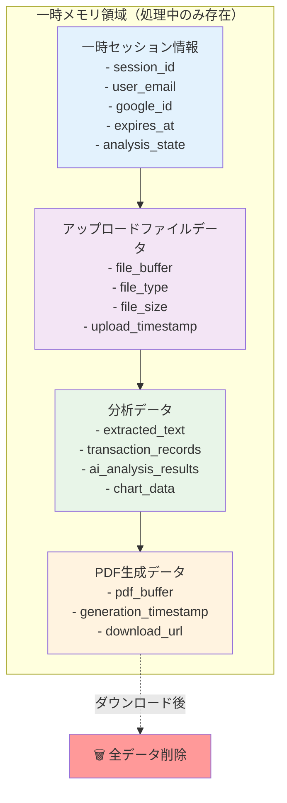
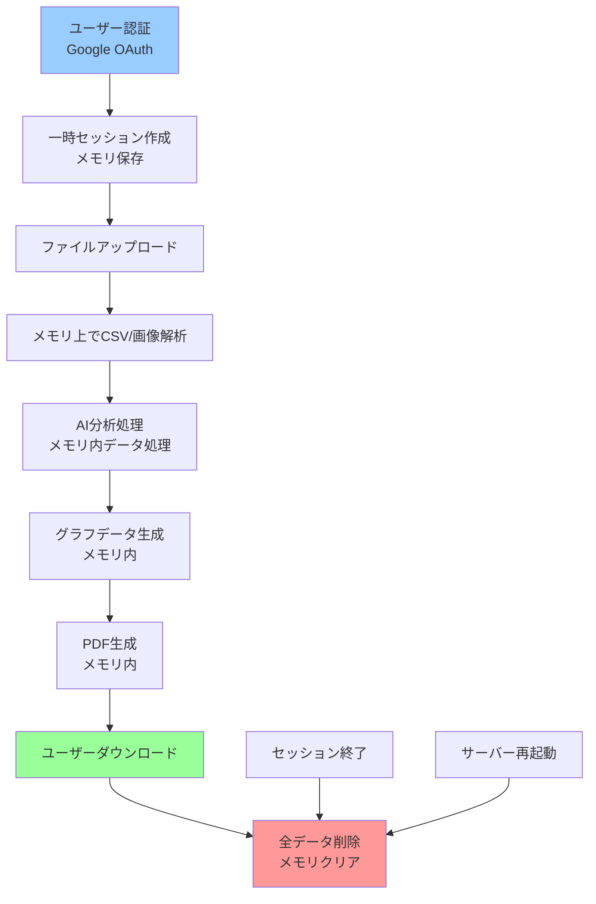

# 銀行取引履歴分析ツール アーキテクチャ図

## システム設計概要

このアーキテクチャ図は、AIを活用した銀行取引履歴分析ツールの**完全ステートレス・メモリベース設計**を表しています。
**データ保存を一切行わない**完全一時処理型のシステムです。

## メモリベース データ構造

## データフロー（メモリ上での処理）

## データ処理ポリシー

### 完全ステートレス設計
- **データベース不使用**: 永続化用データベースは一切使用しない
- **メモリ処理のみ**: アップロードからPDF生成まで全てメモリ上で処理
- **即座削除**: PDF生成と同時に分析データを完全削除
- **セッション管理**: メモリベース（サーバー再起動時に消失）

### セキュリティ
- **データ保護**: 個人の取引データは一切保存されない
- **一時処理**: アップロードファイルは処理後即座に削除
- **セッション管理**: 最小限の一時セッション情報のみメモリに保持
- **認証**: NextAuth.js + Google OAuth 2.0 のみ

### 処理フロー
1. **認証**: Google OAuth 2.0 によるユーザー認証
2. **セッション**: 一時的なセッション情報をメモリに保存
3. **アップロード**: ファイルを一時的にメモリに読み込み
4. **分析**: AIによる取引データ分析（メモリ上）
5. **可視化**: グラフデータ生成（メモリ上）
6. **出力**: PDF生成（メモリ内処理）
7. **ダウンロード**: PDFファイルのダウンロード提供
8. **クリーンアップ**: 全データの即座削除

## 技術実装

### フロントエンド
- Next.js + TypeScript
- 状態管理: Zustand（ローカル状態のみ）
- グラフ: Recharts
- 認証: NextAuth.js (Google OAuth provider)
- スタイリング: Tailwind CSS

### バックエンド
- Next.js API Routes（Serverless Functions）
- メモリ内データ処理
- 一時ファイル処理: Sharp, Papa Parse
- 認証: NextAuth.js

### AI処理
- OpenAI GPT-4
- Google Cloud Vision API (OCR)
- 結果は即座に破棄

### デプロイメント
- Vercel Hosting
- Vercel Serverless Functions
- Vercel Edge Network（CDN）

## 制約事項

### データ保持制限
- 分析データ: **0秒保持**（処理後即削除）
- セッション: **メモリベース**（サーバー再起動時消失）
- 一時ファイル: **処理中のみ**（完了と同時に削除）
- 認証情報: **NextAuth.js セッション**（メモリベース）

### スケーラビリティ
- ステートレス設計により水平スケール可能
- データベース依存なし
- Vercel Serverless Functions での自動スケーリング

### プライバシー保護
- 取引データの永続化なし
- セッション終了時の完全クリーンアップ
- サーバー再起動時の自動データ削除
- プライバシーファーストな設計

## メモリ管理

### メモリ領域の種類
1. **セッションメモリ**: ユーザー認証情報（最小限）
2. **ファイルバッファ**: アップロードファイルの一時保存
3. **分析メモリ**: AI分析結果の一時保存
4. **出力メモリ**: PDF生成データの一時保存

### ガベージコレクション
- 各処理完了時の明示的メモリ解放
- セッション終了時の自動クリーンアップ
- サーバーレス関数終了時の自動メモリ解放
- エラー発生時の強制メモリクリア 