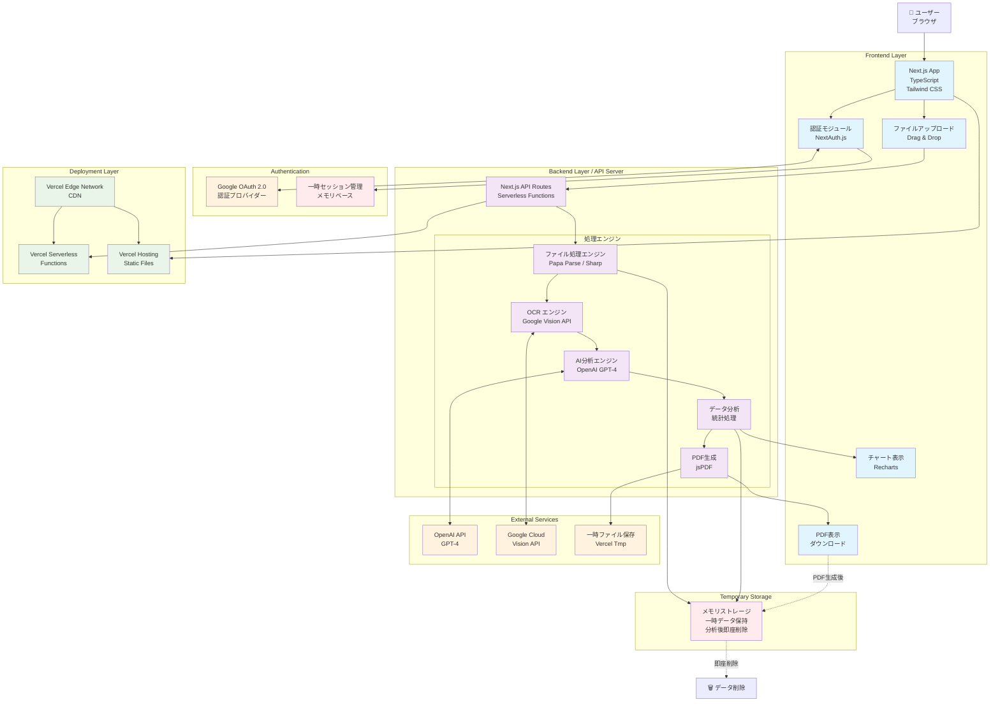

# 銀行取引履歴分析ツール システムアーキテクチャ

## アーキテクチャ概要

このシステムは完全ステートレス・メモリベースなシングルページアプリケーション（SPA）として設計されており、データの永続化を一切行わず、分析後に即座にデータを削除するセキュアな構成となっています。



## システム構成要素

### フロントエンド層（Frontend Layer）
- **Next.js App**: TypeScriptベースのフルスタックアプリケーション
- **認証モジュール**: NextAuth.js による Google OAuth 2.0 認証
- **ファイルアップロード**: ドラッグ&ドロップ対応のファイルアップロード機能
- **チャート表示**: Recharts による可視化
- **PDF表示**: 生成されたPDFレポートの表示・ダウンロード

### バックエンド層（Backend Layer）
- **Next.js API Routes**: Vercel Serverless Functions によるAPIエンドポイント
- **ファイル処理エンジン**: CSV解析（Papa Parse）、画像処理（Sharp）
- **OCRエンジン**: Google Cloud Vision API による文字認識
- **AI分析エンジン**: OpenAI GPT-4 による取引分析
- **データ分析**: 統計処理と支出パターン分析
- **PDF生成**: jsPDF によるレポート生成

### 一時ストレージ（Temporary Storage）
- **メモリストレージ**: 分析中のデータを一時的にメモリに保持
- **即座削除**: PDF生成完了と同時にデータを完全削除
- **セッション管理**: メモリベース（永続化なし）

### 外部サービス（External Services）
- **OpenAI API**: GPT-4による高度なテキスト分析
- **Google Cloud Vision API**: OCR処理
- **Google OAuth 2.0**: ユーザー認証
- **一時ファイル保存**: Vercel Tmpでの一時的なファイル保存

### デプロイメント層（Deployment Layer）
- **Vercel Edge Network**: CDNによる高速コンテンツ配信
- **Vercel Serverless Functions**: API処理の自動スケーリング
- **Vercel Hosting**: 静的ファイル配信

## セキュリティとプライバシー

### データ保護方針
1. **完全ステートレス設計**: データベースを使用せず、完全メモリベース処理
2. **即座削除**: PDF生成後、全ての分析データを即座に削除
3. **メモリベースセッション**: 永続化しないセッション管理
4. **暗号化通信**: 全ての通信でHTTPS/TLS使用

### プライバシー保護
- アップロードされたファイルは処理後即座に削除
- 分析データは一切保存しない
- セッション終了時またはサーバー再起動時の完全クリーンアップ
- 外部APIとの通信も最小限に抑制

## 技術スタック詳細

### フロントエンド
```yaml
言語: TypeScript
フレームワーク: Next.js 14+
スタイリング: Tailwind CSS
チャートライブラリ: Recharts
認証: NextAuth.js (Google OAuth provider)
状態管理: React Hooks / Zustand
```

### バックエンド
```yaml
ランタイム: Node.js 18+
フレームワーク: Next.js API Routes
認証: NextAuth.js (Google OAuth)
ファイル処理: Papa Parse, Sharp
PDF生成: jsPDF
データベース: なし（完全ステートレス・メモリベース）
セッション: メモリベース（永続化なし）
```

### インフラストラクチャ
```yaml
ホスティング: Vercel
サーバーレス関数: Vercel Functions
CDN: Vercel Edge Network
モニタリング: Vercel Analytics + 組み込みログ
```

## データフロー

1. **認証**: ユーザーがNextAuth.js + Google OAuthでログイン
2. **アップロード**: CSV または画像ファイルをアップロード
3. **前処理**: ファイル形式の検証と変換
4. **OCR処理**: 画像の場合、Google Vision APIでテキスト抽出
5. **AI分析**: OpenAI GPT-4による取引内容の分析とカテゴライゼーション
6. **データ処理**: 統計分析と支出パターンの抽出
7. **可視化**: Rechartsによるグラフとチャートの生成
8. **レポート生成**: jsPDFによるPDFレポートの作成
9. **ダウンロード**: ユーザーによるPDFダウンロード
10. **データ削除**: 全ての一時データの即座削除

## スケーラビリティと性能

### 性能要件
- **ファイルサイズ**: 最大100MB
- **レスポンス時間**: 分析完了まで1分以内
- **同時処理**: Vercel Serverless Functions による自動スケーリング

### 最適化戦略
- **並列処理**: OCR と AI分析の並列実行
- **メモリ効率**: ストリーミング処理による メモリ使用量最適化
- **エッジ配信**: Vercel Edge Networkによる高速配信
- **セッション軽量化**: 最小限のセッション情報のみメモリに保持 