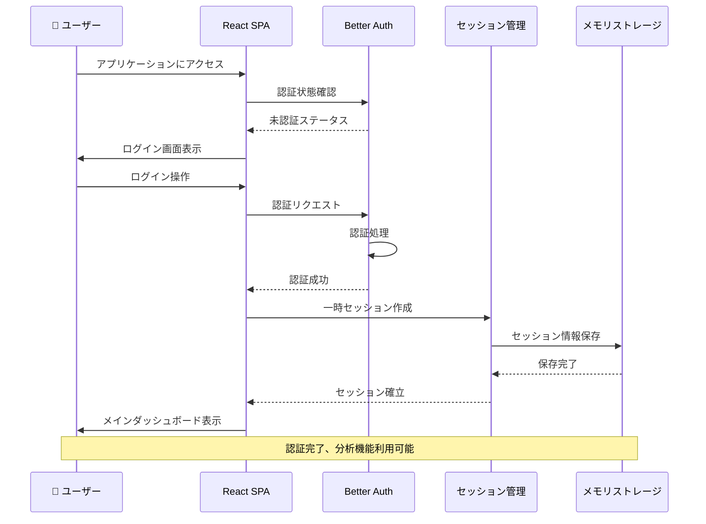
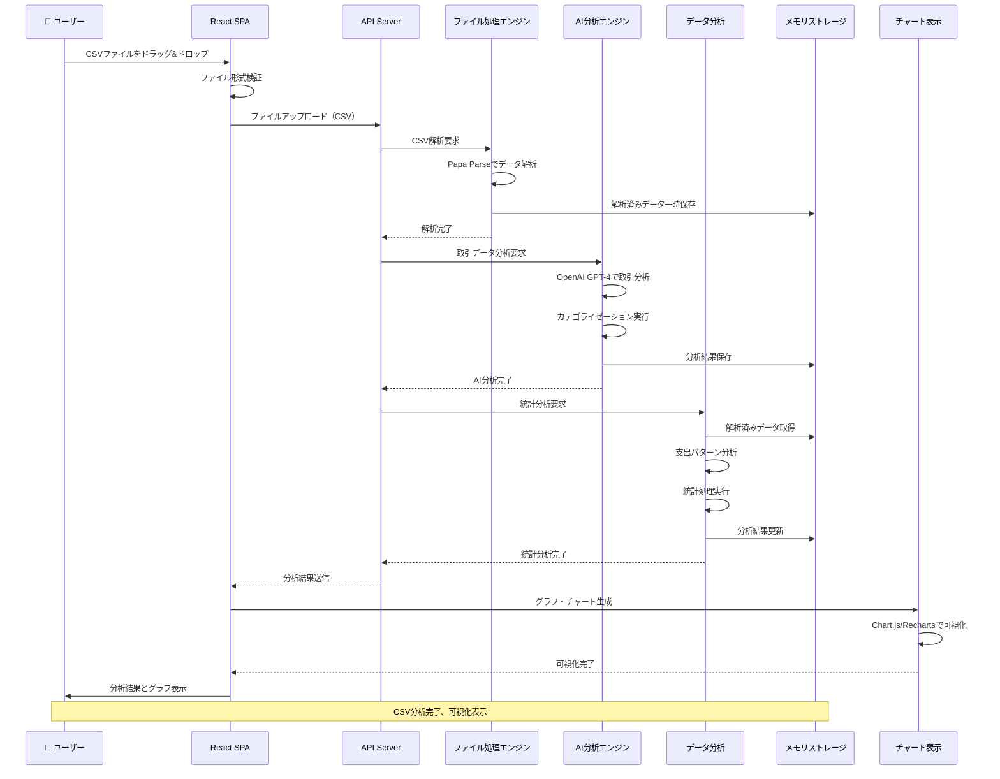
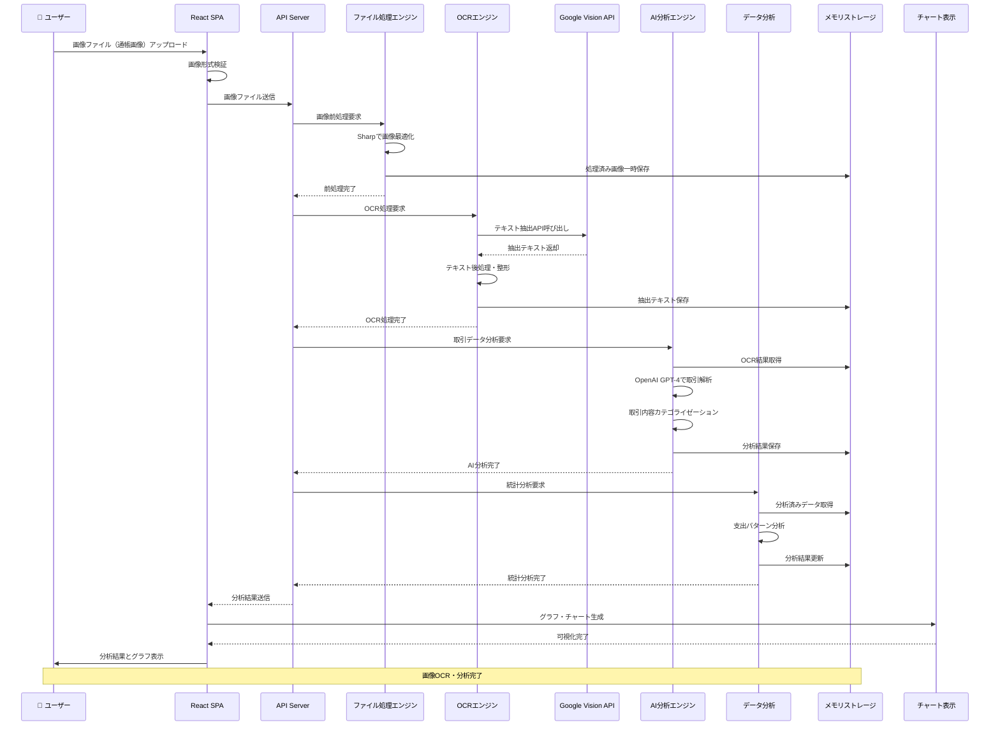
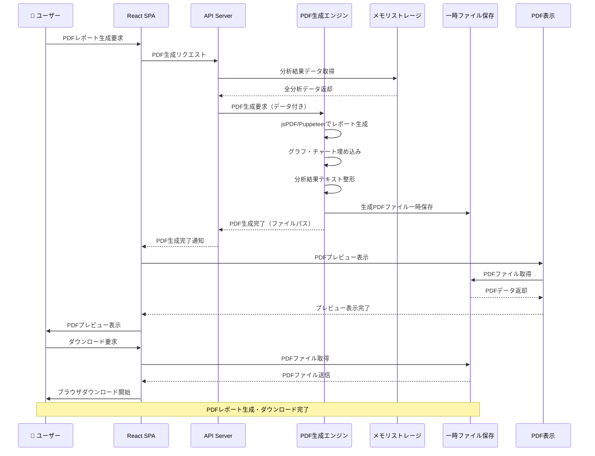
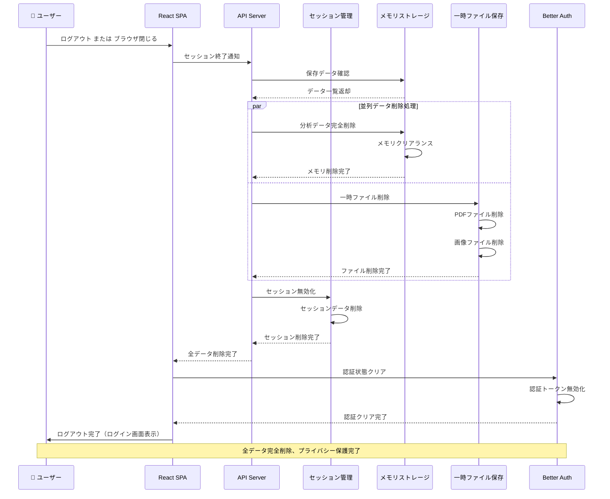
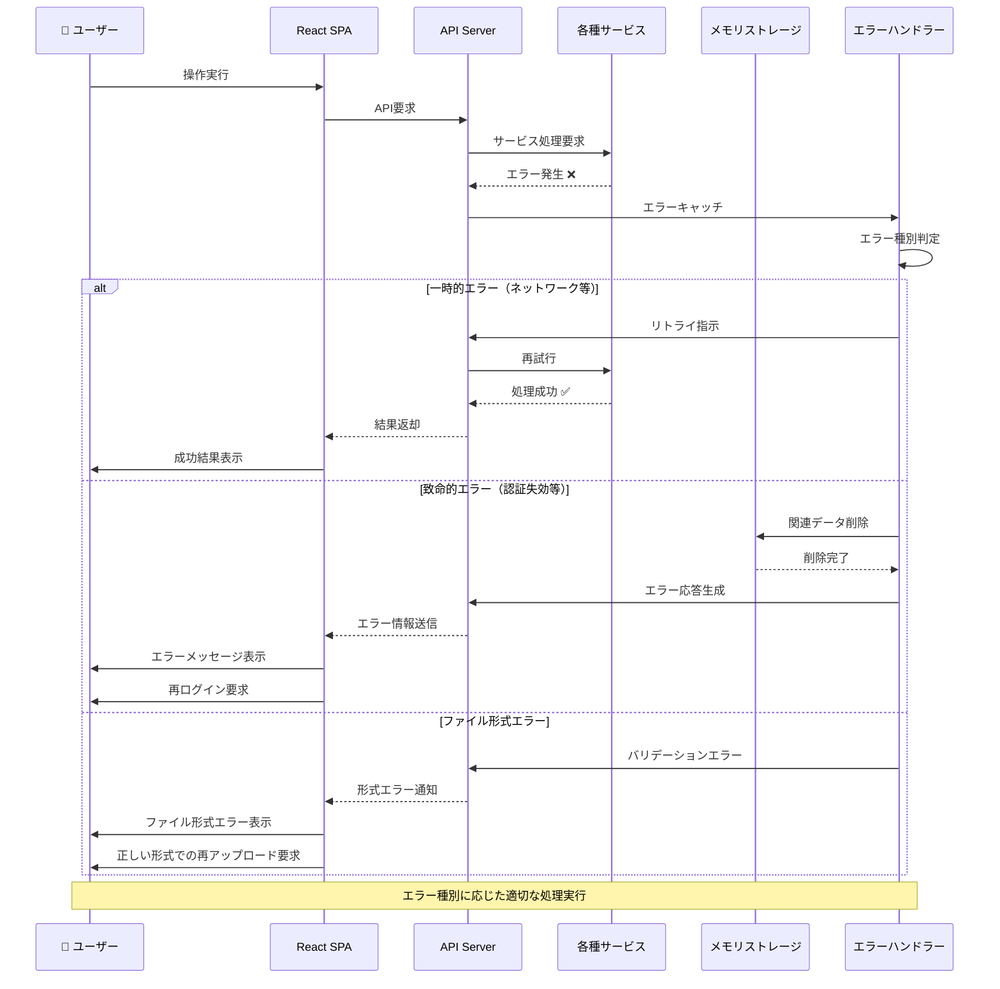

# ユースケース別シーケンス図

## 1. 初回ログイン・認証シーケンス

## 2. CSVファイルアップロード・分析シーケンス

## 3. 画像ファイル（通帳等）OCR・分析シーケンス

## 4. PDFレポート生成・ダウンロードシーケンス

## 5. セッション終了・データ完全削除シーケンス

## 6. エラーハンドリング・復旧シーケンス

## シーケンス図の説明

### 設計原則
1. **ステートレス**: 各処理でデータの永続化を避け、メモリベース処理
2. **セキュリティファースト**: 処理完了後の即座データ削除
3. **並列処理**: パフォーマンス向上のための並列実行
4. **エラー耐性**: 各段階でのエラーハンドリングと復旧

### 主要な特徴
- **データプライバシー**: セッション終了時の完全データ削除
- **リアルタイム処理**: OCR、AI分析の非同期処理
- **ユーザビリティ**: プログレス表示とエラーフィードバック
- **スケーラビリティ**: 並列処理による高速化 